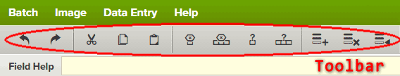
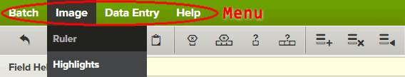
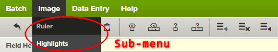

Directive iv-on-cmd - Handling many events in one place.
===================

\* **This directive requires jQuery and will not work with jqLite** *

##Introduction

`iv-on-cmd` is an Angular directive that allows for a single event handler to handle click events for all child elements of the element containing the directive `iv-on-cmd` as long as the child elements have the attribute `data-cmd` set.

The goal of `iv-on-cmd` is to reduce the number of `ng-click` handlers and provide a single common function to handle all of the children.

##Background

I have discovered that Angular tends to slow down with too many bindings and I have read articles that indicate that as few as two-thousand bindings can be too many bindings.

I have had several projects where an `ng-repeat` created several hundred to several thousand elements. And each of these elements had between three and thirty bindings. Angular slows down with too many bindings and I have heard that as few as two-thousand bindings can be too many and I had many more then that.

I needed a way to do something I used to do with jQuery. And that is use a single click handler on a wrapper `<div>` that allows me to get the commands for all of the wraper's children. Using jQuery I would do the following:

```html
<div class="main-wrapper">
  <button class="start-process">Start</button>
  <button class="cancel">cancel</button>
</div>
```

*The above is a greatly simplified DOM, but it works for this explanation.*

With the example HTML above I would add some jQuery to process each `<button>` independently:

```javascript
function startProcess() {
  // Do some kind of process here
}

function cancel() {
  // Cancel the operation here
}

$(document).ready(function() {
  $(".start-process").on("click", startProcessFn);
  $(".cancel").on("click", cancelFn);
});
```

But when I had hundreds of these buttons, or other DOM elements, it got to be a massive process.

Angular helped fix this by allowing you to set the click handler via the `ng-click` directive, like this:

```html
<div class="main-wrapper" data-ng-controller="myCtrl">
  <button data-ng-click="startProcess()">Start</button>
  <button data-ng-click="cancel()">cancel</button>
</div>
```

Then in the controller code I would do this:

```javascript
angular.module("mine").controller("myCtrl", myCtrl);
myCtrl.$inject = ["$scope"];
function myCtrl($scope) {
  $scope.startProcess = function() {
    // Do some kind of process here
  };

  $scope.cancel = function() {
    // Cancel the operation here
  }
}
```

But this could still, with hundreds of `ng-click` directives, cause a massive number of bindings to occur.

##My jQuery Solution

To resolve the many event bindings in jQuery I create a *command handler*. This would utilize the `delegate` version of the `$().on()` function. This is done by setting the `$().on()` handler on a parent and specify the children that will cause your code to be called. So with this HTML:

```html
<div class="main-wrapper">
  <button data-cmd="start-process">Start</button>
  <button data-cmd="cancel">cancel</button>
</div>
```

And the script would look like this:

```javascript
function processCmd(event) {
  var $el = $(event.target);
  var cmd = $el.data("cmd");

  console.log("Command was %s", cmd); 

  // Process the commands.
  switch(cmd) {
    case "start-process":
      // Do something
      break;

    case "cancel":
      // Do something
      break;
}
}

$(document).ready(function() {
  $(".main-wrapper").on("click", "[data-cmd]", processCmd);
});
```

With this code the `click` handler is a delagated handler. Meaning that when the user clicks on the `<button>` the event is delegated to the event handler connected to the `<div>` tag. But only if the buttons have the attribute `data-cmd`. Now, even with hundreds of buttons, I only have one event handler.

The example above is small enough that what I am describing may not make sense. But imagine having something that is repeated and the only difference between each of them is an index value or some form of a key value. Take a web-based message application as an example. Each message has it's own unique identifier. If each message had a read button and a delete button then you would need two event handlers per message. But using the delegate for of `$().on()` we can have one event handler that handles all of the messages.

```html
<div class="mail-shell">
  <div class="message">
    <span class="sender">someone@example.com</span>
    <span class="subject">Some message subject</span>
    <span class="time">3:43 am</span>
    <span><button data-cmd="read" data-cmd-data="KE1R-DJ5KW-9SJ21">Read</button></span>
    <span><button data-cmd="delete" data-cmd-data="KE1R-DJ5KW-9SJ21">Delete</button></span>
  </div>
  <div class="message">
    <span class="sender">person@example.com</span>
    <span class="subject">Buy something from us</span>
    <span class="time">2:49 am</span>
    <span><button data-cmd="read" data-cmd-data="K19D-0PWR8-MMK92">Read</button></span>
    <span><button data-cmd="delete" data-cmd-data="K19D-0PWR8-MMK92">Delete</button></span>
  </div>
  <div class="message">
    <span class="sender">bot@example.com</span>
    <span class="subject">Buy a Rolex from us</span>
    <span class="time">2:31 am</span>
    <span><button data-cmd="read" data-cmd-data="LK0P-HN8GT-00LPD">Read</button></span>
    <span><button data-cmd="delete" data-cmd-data="LK0P-HN8GT-00LPD">Delete</button></span>
  </div>
</div>
```

Now imagine hundreds of these messages instead of the three in the example above.

Using a few lines of code and only one event handler we can handle all of the `click` events for all of the buttons, even if a new message show up after we set up our event handler.

```javascript
function processCmd(event) {
  var $el = $(event.target);
  var cmd = $el.data("cmd");
  var cmdData = $el.data("cmdData");
  switch(cmd) {
    case "read":
      openMessage(cmdData);
      break;

    case "delete":
      deleteMessage(cmdData);
      break;
  }
}

$(document).ready(function() {
  $(".main-wrapper").on("click", "[data-cmd]", processCmd);
});

```

##My Angular Directive: `iv-on-cmd`

My Angular directive, `iv-on-cmd`, uses the delegate functionality of jQuery to simplify Angular code. It does some of the behind-the-scenes work for you. It figures out what the command `cmd` is and the command data `cmdData` and inserts that into the `$event.data` object. Then it passes $event through to your handler.

The following HTML example has the `iv-on-cmd` directive on the outer `<div>`. This allows one event handler `processCmd()` to handle all of the click events from the three child buttons.

```html
<div data-ng-controller="myCtrl" data-iv-on-cmd="processCmd($event)">
  <button data-cmd="sayHello">Say Hello</button>
  <button data-cmd="speak" data-cmd-data="Hi">Say Hi</button>
  <button data-cmd="speak" data-cmd-data="Bye">Say Bye</button>
</div>
```

The example controller below supplies the `processCmd()` function that is to be accessed any time the user clicks on one of the buttons with the `data-cmd` attribute.

```javascript
angular.module("mine").controller("myCtrl", myCtrl);
myCtrl.$inject = ["$scope"];
function myCtrl($scope) {
  $scope.processCmd = function($event) {
    $event.stopPropigation();
    $event.preventDefault();
  	 if ($event.data.cmd === "sayHello") {
  	   alert("Hello");
  	   return;
  	 }

  	 if ($event.data.cmd === "speak" ) {
  	 	alert("Speaking: " + $event.data.cmdData);
  	 	return;
  	 }
  }
}
```

In the buttons that have `data-cmd="speak"` the code will also use the attribute `data-cmd-data`. This attribute value is read and placed into the `$event.data` object along with the value from `data-cmd`.

For this button:
```html
<button data-cmd="sayHello">Say Hello</button>
```

The object `$event.data` will be:

```JSON
{
  "cmd": "sayHello",
  "cmdData": undefined
}
```


For this button:
```html
<button data-cmd="speak" data-cmd-data="Hi">Say Hi</button>
```

The object `$event.data` will be:

```JSON
{
  "cmd": "speak",
  "cmdData": "Hi"
}
```

You can also include objects in the `data-cmd-data` attribute.

For this button:
```html
<button data-cmd="buy" data-cmd-data='{"title":"Test Product", "price": 3.95}'>Buy Now</button>
```

The object `$event.data` will be:

```JSON
{
  "cmd": "buy",
  "cmdData": {
    "title": "Test Product",
    "price": 3.95
  }
}
```

### Example: Menus and Toolbars

I had a project that had both a menu, with sub-menus, and a tool bar. Most of the menu items were replicated by the tool bar elements. So the user could perform the same operation using the menu or using a toolbar button.

Here is the toolbar:


And the menu:


And the sub-menu:



The menu was created using one directive and the toolbar was created using a second directive. But both directives just added the attribute `data-cmd` to the DOM elements and did not process the click events. (With the exception of the menu that would toggle the sub-menu open and closed.)

The menu and toolbar were contained within a single `<div>` and it was on this `<div>` that I added the directive `iv-on-cmd` like below:

```html
<div data-iv-on-cmd="processCmd($event)">
  <ul class="menu">
    <li>
      <button data-ng-click="toggle('batch')">Batch</button>
      <ul class="sub-menu" data-menu="batch">
        <li>...</li>
        ...
      </ul>
    </li>
    <li>
      <button data-ng-click="toggle('image')">Image</button>
      <ul class="sub-menu" data-menu="image">
        <li><button data-cmd="ruler">Ruler</button></li>
        <li><button data-cmd="highlights">Highlights</button></li>
      </ul>
    </li>
    ...
  </ul>
  <div class="toolbar">
    <button class="toolbar__button" data-cmd="unto"></button>
    <button class="toolbar__button" data-cmd="redo"></button>
    <span class="toolbar__separator"></span>
    <button class="toolbar__button" data-cmd="cut"></button>
    <button class="toolbar__button" data-cmd="copy"></button>
    <button class="toolbar__button" data-cmd="paste"></button>
    <span class="toolbar__separator"></span>
    ...
  </div>
</div>
```

The controller provided a single function `processCmd()` that would process each of the commands.

```js
angular.module("mine").factory("myService", myService);
function myService() {
  return {
    "undo": undoFn,    
    "redo": redoFn,    
    "cut": cutFn,    
    "copy": copyFn,    
    "paste": pasteFn    
  }

  function undoFn() {
    // Do something
  }
    
  function redoFn() {
    // Do something
  }
    
  function cutFn() {
    // Do something
  }
    
  function copyFn() {
    // Do something
  }
    
  function pasteFn() {
    // Do something
  }
}

angular.module("mine").controller("myCtrl", myCtrl);
myCtrl.$inject = ["$scope", "myService"];
function myCtrl($scope, myService) {
  $scope.processCmd = function($event) {
    $event.stopPropigation();
    $event.preventDefault();
    var cmd = $event.data.cmd;

    if (myService.hasOwnProperty(cmd)) { // See is the service supports the command
      myService[cmd]($event.data.cmdData); // $event.data.cmd will default to undefined
    }
    else {
      // Display an error or throw an exception
      // The cmd is not supported in teh service 
    }
  }
}
```

This is a very simple example. But it shows that we can generate simple HTML that supplies `data-cmd` attributes. Then, with a single command handler, we can process those commands. In this example I also moved the work of processing the commands off to a service. Though you may need to perform async operations or get data back from the service call which would change the way the code was written.


###The need for jQuery and not jqLite

This directive requires you to load jQuery before loading Angular. It does not work with the jqLite found in Angular because jqLite does not support the delegate mode of the `$().on()` function.

jQuery version 1.7 or greater is required because those support the delegate mode of the `$().on()` function.

```js
<script src="jquery_min.js"></script>
<script src="angular_min.js"></script>
```

### Questions...

I hope that I have provided enough examples to help show the value of the `iv-on-cmd` directive. If you have questions, please ask them. 
